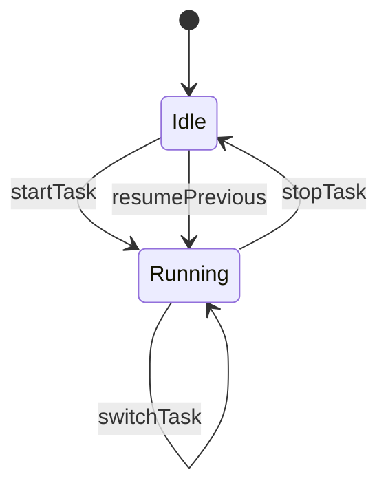

# Architecture

## Components

| Piece | Responsibility |
|-------|----------------|
| [`packages/extension`](../../packages/extension) | VS Code / Cursor extension: commands, status bar, summary webview, JSON persistence, bundled MCP (`src/mcp`, built to `out/mcp/index.js`) |

The MCP server shares the same timer engine contract and storage path as the UI (see [mcp.md](mcp.md)).

## Activation

- **`onStartupFinished`** is used so the **status bar** is available without running a command first (small extension footprint).
- **`onCommand:*`** entries are also listed so command-only activation remains documented and tooling can discover them.

## Timer state machine

- **`switchTask` / `startTask`:** close the running `TimeEntry` (`end = now`), then append a **new `Task`** (new UUID) and a **new `TimeEntry`** with `start = now`, `end = null`. No concurrent open segments; each segment is an independent start/stop interval.
- **`resumePrevious`** (idle only): creates a **new `Task`** (`id` = new UUID) copying **`lastStopped.description`**, then appends a **new `TimeEntry`** with `start = now`, `end = null`. Each **completed** segment has **duration** = `Date.parse(end) - Date.parse(start)` (see `timeEntryDurationMs`). Edge cases: no `lastStopped` → no-op; missing `Task` row still resumes from `lastStopped.description` on disk.
- **Alignment interval (`timeKeeper.alignmentIntervalMinutes`):** workspace setting **0** = disabled. When ≥ 1 minute, each time a segment is **closed** (stop, switch, or start that ends the prior segment), the ledger keeps **raw** `start` / `end` (wall clock) and adds optional **`alignedStart`** (ISO UTC, floor to grid) and **`alignedDurationMs`** (integer ms from that start to the grid **ceiled** end), so the aligned span **never shortens** the raw duration. The running row has no aligned fields until close. Re-closing with alignment off clears `alignedStart` / `alignedDurationMs`. MCP uses env `TIME_KEEPER_ALIGNMENT_INTERVAL_MINUTES` (see [mcp.md](mcp.md)).
- **Timesheet text (`timeKeeper.timesheetUseAlignedValues`):** when **true**, command **`timeKeeper.buildTimesheetText`** attributes each finished segment’s overlap with **each local calendar day** in the chosen **inclusive range** using aligned bounds when stored; segments without aligned data (or still **running**) use raw `start`/`end`.

## Clock semantics

- **Elapsed display while running:** status bar uses wall-clock elapsed from persisted segment start (`Date.now() - Date.parse(start)`), refreshed every 500ms.

## Persistence (implemented)

**Chosen format:** single versioned JSON snapshot **`time-keeper-state.v1.json`** under `ExtensionContext.globalStorageUri`, written with **temp file + rename** for atomic replace.

- **Schema** (`PersistedState`): `version: 2` (`version: 1` files are migrated on load), `tasks` map (`id` → `Task` with **`description` only**), `entries` array (`TimeEntry` with `start`, `end: null` while running, optional `alignedStart` + `alignedDurationMs` after close when alignment is enabled), `lastStopped` (`taskId`, `description`). **Summary:** command **`timeKeeper.openSummary`** opens an **editor-area webview** with a **table** of segments (start, end, duration, aligned columns when stored, description) and **client-side filters** (description substring, duration min/max seconds, start/end time modes: any, calendar day, inclusive day range, or between two local date-times). Rows can be **edited** in-place for **description** and raw **start** / **end** (finished segments only get end); duration and aligned fields are **derived** on save. Live refresh pauses while a row is being edited. Running rows refresh about once per second when not editing. **Export visible rows to CSV** sends filtered rows from the webview to the extension host, then **`showSaveDialog`** + **`workspace.fs.writeFile`** (UTF-8 with BOM, RFC-style escaping for commas/quotes/newlines).
- **Module:** [`packages/extension/src/storage/jsonlStore.ts`](../../packages/extension/src/storage/jsonlStore.ts) (`JsonlStore` class — name retained from planning; implementation is snapshot JSON, not line-delimited JSONL).

Store location remains **global storage**, not the workspace.

Discussion of alternative stores and sync patterns (not used by the current extension) is in [persistence.md](persistence.md).

## Extension module layout

Keep files small and testable:

- `extension.ts` — activate/deactivate wiring
- `commands/*` — command handlers
- `timer/*` — state machine + persistence port
- `storage/jsonlStore.ts` — load/save persisted state (v1 → v2 migration)
- `ui/statusBar.ts` — status bar item(s)
- `ui/summaryPanel.ts` — Summary **webview panel** (table + push updates)
- `media/summaryPanel.{css,js}` — webview UI for filters and grid
- `mcp/*` — bundled MCP entrypoint

## MCP (AI control)

See [mcp.md](mcp.md). The MCP server is a **separate Node entrypoint** (`out/mcp/index.js`) shipped in the VSIX; it uses the same **timer state machine** and **persistence schema** as the extension host when `TIME_KEEPER_GLOBAL_STORAGE` matches the extension’s global storage directory.
