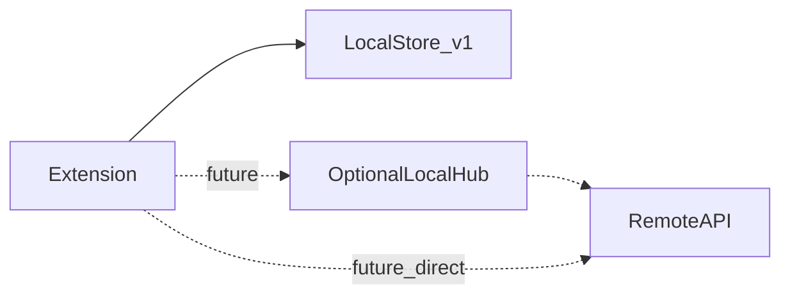

# Persistence and synchronization

This document describes how **time entries** are stored, how they might be **aggregated** locally, and how **remote synchronization** could fit in—without requiring any particular database for v1.

## v1 (IDE extension): no local server database

The VS Code / Cursor extension runs in an **extension host** with no guarantee of a local PostgreSQL or MongoDB instance. Persistence is a **single JSON snapshot** (`time-keeper-state.v1.json` filename; **`version` field 2** inside the file) under `ExtensionContext.globalStorageUri` (atomic temp + rename). Older **`version: 1`** documents (title + optional description) are **migrated on load** to description-only tasks. See [architecture.md](architecture.md).

Other **single-machine** options that remain valid if the implementation changes:

- **Append-only JSONL** (or other flat files) under `globalStorageUri`, or
- **Embedded SQLite** (for example `sql.js` / WASM to avoid native addon friction).

That model is **single-machine, single-user**, optimized for low friction and no extra infrastructure.

## When a local PostgreSQL or MongoDB makes sense

A **local server database** becomes relevant if you introduce a **separate process** the extension (or a future desktop app) talks to—for example:

| Driver | Typical shape |
|--------|----------------|
| **Reporting and aggregation** | Heavy queries across months of entries, dashboards, or joins with non–Time Keeper tables. |
| **Multi-surface clients** | Extension + native tray app + CLI all reading/writing the same store concurrently. |
| **Sync preparation** | A durable local “hub” that batches outbound changes and applies inbound merges. |

In that world, the extension is **not** embedding Postgres/Mongo inside the host; it uses **HTTP**, **TCP**, or **Unix domain sockets** to a small **local service** (sidecar, daemon, or developer-run Docker compose stack).

### PostgreSQL vs MongoDB (high level)

| Aspect | PostgreSQL | MongoDB |
|--------|------------|---------|
| **Time intervals** | Natural fit: rows with `start_at`, `end_at`, `task_id`, constraints (e.g. `end_at > start_at`), indexes for range queries. | Natural fit as **documents per entry** or per day; aggregations via aggregation pipeline; schema flexibility for evolving metadata. |
| **Transactions / consistency** | Strong ACID for sync cursors, outbox tables, and “exactly one active timer” invariants if enforced in DB. | Multi-document transactions exist; most teams still design around **document boundaries** and idempotent sync keys. |
| **Ops for developers** | Familiar for teams already running Postgres; easy to mirror to a remote Postgres for sync. | Familiar for document-centric stacks; sync to MongoDB Atlas or custom API. |

**Neither is required for v1.** Choosing between them is a **product/ops** decision once you commit to a local service and a remote backend shape.

## Remote server synchronization (optional future)

If entries must appear on a **remote server** (team billing, backup, web UI), a common pattern is:

Paths:

1. **Extension → remote API** — Simplest operationally: HTTPS with auth, send entries or diffs on a schedule or when online. Local store remains source of truth until acknowledged.
2. **Extension → local DB → remote** — Local DB acts as **queue + cache**: extension writes locally fast; a **sync worker** (same machine) pushes to remote and applies server-side merges.
3. **Conflict handling** — Define rules early: e.g. **last-write-wins** per entry id, **append-only** entries with immutable ids, or **vector clocks** only if multi-writer offline editing is real. For time tracking, **immutable time-entry rows** with unique ids usually simplify sync.

## Recommendations (current direction)

- **v1:** File or embedded SQLite under `globalStorageUri`; **no** bundled PostgreSQL/MongoDB requirement.
- **Next step if aggregation is needed:** Add an **optional** local HTTP service and document a **single schema** (SQL or document shape) so extension and future native app can share it.
- **Sync:** Specify a **remote API contract** (REST or GraphQL) and an **outbox** or **sync state** table/collection when you implement—not before product needs multi-device or team visibility.

## Related specs

- [architecture.md](architecture.md) — State machine and extension storage location.
- [roadmap-native.md](roadmap-native.md) — Native shell and shared core; same persistence port can target local DB later.
